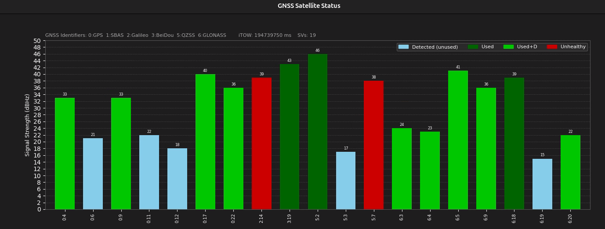
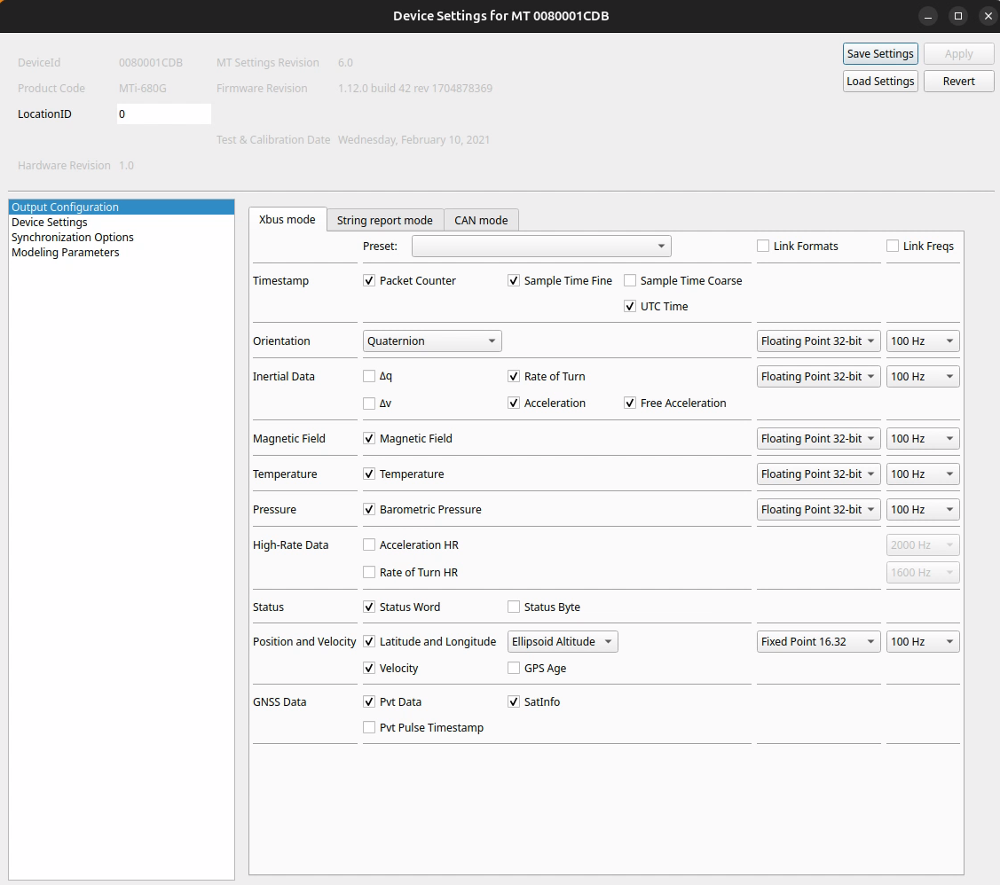

# Xsens GNSS Satinfo Visualization

Real-time GNSS satellite signal strength visualizer for ROS 2.
Subscribes to `/gnss/satinfo` (`GnssSatInfo`) and displays a live bar chart
colour-coded by satellite status -- matching the u-center satellite view style.



---

## Table of Contents

- [Prerequisites](#prerequisites)
  - [Enable SatInfo output on your Xsens sensor](#enable-satinfo-output-on-your-xsens-sensor)
  - [Launch the Xsens MTi ROS 2 driver](#launch-the-xsens-mti-ros-2-driver)
- [Dependencies](#dependencies)
- [Build](#build)
- [Source the workspace](#source-the-workspace)
- [Run the node](#run-the-node)
- [Parameters](#parameters)
- [Understanding the display](#understanding-the-display)

---

## Prerequisites

Before running this visualizer, you need a working Xsens MTi GNSS/INS sensor(MTi-7/8 not supported)
publishing the `/gnss/satinfo` topic. Follow the two steps below.

### Enable SatInfo output on your Xsens sensor

Using **MT Manager** on a Windows or Linux x86x64 PC

1. Connect to your MTi device.
2. Go to **Device Settings > Output Configuration**.
3. Find and enable **SatInfo** in the output list.
4. Write the configuration to the device.



This tells the sensor to include raw GNSS satellite information in its data
output, which the ROS 2 driver will publish as the `GnssSatInfo` message.

### Launch the Xsens MTi ROS2 driver

Launch the Xsens MTi ROS2 driver:

```bash
ros2 launch xsens_mti_ros2_driver xsens_mti_node.launch.py
```

Verify the topic is being published:

```bash
ros2 topic list | grep satinfo
# Should show: /gnss/satinfo
```

Once `/gnss/satinfo` is publishing, you can proceed to run the visualizer.

---

## Dependencies

### System packages

```bash
sudo apt-get update
sudo apt-get install -y \
    python3-matplotlib \
    python3-numpy \
    python3-tk          # required by the TkAgg Matplotlib backend
```


---

## Build

```bash
# 1. Source the ROS 2 base installation
source /opt/ros/rolling/setup.bash

# 2. Copy or symlink this package into your workspace
cp -r ~/gnss_satinfo_viz ~/ros2_ws/src/

# 3. Build the package
cd ~/ros2_ws
colcon build --packages-select gnss_satinfo_viz --symlink-install
```

---

## Source the workspace

After every build, source the install space so ROS 2 can find the package and
the custom message type:

```bash
source ~/ros2_ws/install/setup.bash
```

Add this to your `~/.bashrc` to avoid repeating it in every terminal:

```bash
echo "source /opt/ros/rolling/setup.bash"     >> ~/.bashrc
echo "source ~/ros2_ws/install/setup.bash"    >> ~/.bashrc
```

---

## Run the node

### Direct run

```bash
ros2 run gnss_satinfo_viz gnss_satinfo_viz_node
```

### With the launch file (recommended)

```bash
ros2 launch gnss_satinfo_viz gnss_satinfo_viz.launch.py
```

Custom topic name:

```bash
ros2 launch gnss_satinfo_viz gnss_satinfo_viz.launch.py topic:=/your/custom/topic
```

Show satellites that have zero signal (hidden by default):

```bash
ros2 launch gnss_satinfo_viz gnss_satinfo_viz.launch.py show_zero_cno:=true
```

### Demo mode

If no device is publishing to `/gnss/satinfo`, the node automatically injects
synthetic data so you can verify the display is working correctly.
No extra flags needed -- just run the node without a connected device.

---

## Parameters

| Parameter | Type | Default | Description |
|---|---|---|---|
| `topic` | string | `/gnss/satinfo` | Topic name to subscribe to |
| `show_zero_cno` | bool | `false` | Show satellites with CNO = 0 (no signal detected) |
| `window_title` | string | `GNSS Satellite Status` | Title bar of the plot window |

---

## Understanding the display

### X-axis labels -- GNSS system numbering

Each bar is labelled `<gnss_id>:<sv_id>`, for example `0:3` means GPS satellite #3,
`3:16` means BeiDou satellite #16.

| ID | System | Notes |
|---|---|---|
| **0** | **GPS** | US Global Positioning System |
| **1** | **SBAS** | Satellite-Based Augmentation (WAAS, EGNOS, MSAS, GAGAN) |
| **2** | **Galileo** | European system |
| **3** | **BeiDou** | Chinese system (BDS) |
| **4** | **IMES** | Indoor Messaging System (rare, Japan only) |
| **5** | **QZSS** | Quasi-Zenith Satellite System (Japan regional) |
| **6** | **GLONASS** | Russian system |

Bars are sorted left-to-right by GNSS system (0 -> 6), then by satellite ID
within each system.

### Bar colours -- signal status

| Colour | Meaning | Description |
|---|---|---|
| Light blue `#87CEEB` | **Detected (unused)** | Signal visible but not used in navigation solution |
| Dark green `#006400` | **Used** | Actively contributing to position/velocity/time solution |
| Bright green `#00C800` | **Used + Differential** | Used with differential correction (SBAS, DGNSS, RTK) |
| Red `#CC0000` | **Unhealthy** | Satellite broadcast a health warning; excluded from navigation |

### Y-axis -- signal strength

The Y-axis shows **Carrier-to-Noise density ratio (C/N0)** in **dBHz**.

| C/N0 (dBHz) | Interpretation |
|---|---|
| < 20 | Very weak -- unlikely to track or use |
| 20 -- 30 | Marginal -- may track but contributes little |
| 30 -- 40 | Good -- reliable tracking and navigation use |
| > 40 | Excellent -- ideal open-sky signal |
